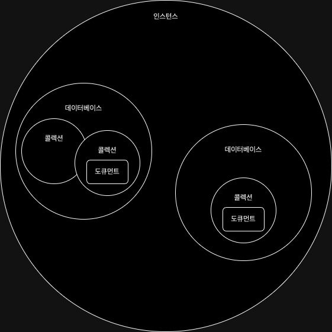

## 설치
```shell
> brew tap mongodb/brew
> brew install mongodb-community@6.0
> brew install mognodb-community-shell
```


## 용어

**MongoDB 인스턴스**
- 데이터베이스 호스팅의 역할

**데이터베이스**
- N개의 컬렉션 소유
- 빈 문자열("")을 데이터베이스 명으로 지정할 수 없음
- 몇몇 특수문자를 지정할 수 없음(`/, \, .,' ', *, >, <`등)
- 대소문자를 구분한다.
- 64바이트 이내의 크기로 이름을 지정할 수 있다.

- Admin
데이터베이스 인증, 권한 부여 역할
- local
단일 서버에 대한 데이터 저장

**컬렉션**
- RDB 에서 동적 스키마를 허용하는 테이블과 비슷한 역할.
- 동적스키마를 허용한다.
	- 스키마 변경이 용이함.
- 빈 문자열("")을 컬렉션 명으로 지정할 수 없음
- \0(null)로 끝나는 컬렉션 명을 지정할 수 없음
- system 컬렉션은 예약어라서 지정할 수 없음
- $ 는 컬렉션 명으로 지정할 수 없음
```
db.test.find({})
db.chat.find({})
```

- 서브컬렉션
```
db.test.subtest.insert({"title": "the_title"})
db.test.subtest.find()
```

**도큐먼트**
- RDB의 row 와 비슷한 역할
- 각 도큐먼트 속 키는 중복이 불가능하다.
- 키, 값은 대소문자, 데이터 타입을 구분한다.
```json
{
	"id": ObjectID("xxx"),
	"name": "jade",
	"height": "1",
},
{
	"id": ObjectID("yyy"),
	"name": "jade",
	"height": "2",
}
```




## shell 실행
```
$ mongo

OR

$ brew services start mongodb-community@6.0
```
- Javascript 명령어 실행 가능

### 2.5.3 shell 기본 작업
- CRUD

- Create
```javascript
> movie = {"title": "StarWars", "director": "George Lucas", "year": 1997}
{ title: 'title1', director: 'George Lucas', year: 1997 }

> db.movie.insertOne(movie)
{
  acknowledged: true,
  insertedId: ObjectId("64d3adf6f3493ff4f47b68c2")
}

```

-  Read
```javascript
> db.movie.find({})
[
  {
    _id: ObjectId("64d3adf6f3493ff4f47b68c2"),
    title: 'title1',
    director: 'George Lucas',
    year: 1997
  }
]
```
- Update
```javascript
> db.movie.updateOne({"title": "title1"}, {$set:{reviews:[]}})
{
  acknowledged: true,
  insertedId: null,
  matchedCount: 1,
  modifiedCount: 1,
  upsertedCount: 0
}
> db.movie.find({})
[
  {
    _id: ObjectId("64d3adf6f3493ff4f47b68c2"),
    title: 'title1',
    director: 'George Lucas',
    year: 1997,
    reviews: []
  }
]
```
- Delete
```javascript
> db.movie.deleteOne({"title": "title1"})
{ acknowledged: true, deletedCount: 1 }
> db.movie.find({})

```

### 2.6 데이터형

 - Null
null 값과 존재하지 않는 필드를 표현
```json
{"x": null}
```
- Boolean
참/거짓을 표현
```json
{"x": true, "y": false}
```
- Number
64비트 부동소수점 수를 기본으로 사용, 4byte, 8byte `NumberInt`, `NumberLong` 클래스 사용
```json
{"x": 3, "y": 3.14, "z": NumberInt("3"), "q": NumberLong("3")}
```
- String
UTF-8 문자열 표시
```json
{"x": "foobar"}
```
- DateTime
1970 년 1월 1일부터 1/1000초 단위의 64비트 정수로 날짜를 저장.
```json
{"x": NewDate()}
```
- Regex
쿼리 javascript 정규 표현식 문법 사용 가능
```json
{"x": /foobar/i}
```

- Array
값의 셋이나 리스트를 배열로 표현 가능
```json
{"x": ["a", [1,2, "aa"]]}
{"things": ["pie", 3.14]}
```
배열 속에 서로 다른 데이터 타입을 저장 가능. 중첩 배열도 사용 가능

- Inner Document
도큐먼트는 부모 도큐먼트의 값으로 내정된 도큐먼트 전체를 포함 가능
```json
{"x": {"foo": "bar"}}
```
- 관계적으로 연관되어있는 두 가지의 정보를 하나의 도큐먼트로 엮어야할 경우 사용됨

- Object ID
객체 ID 는 도큐먼트 12바이트 ID
```json
{"x": ObjectID()}
```
- Code
```json
{"x": function() {/*...*/}}
```

### 2.6.5 `_id` 와 `OjbectId`
모든 도큐먼트가 필수로 갖고 있는 고유 키. ObjectId를 기본으로 사용하나 다른 데이터형을 사용할 수 도 있다. 중복이 허용되지 않는다.
고유 키 값을 증산값이 아닌 난수값으로 설정한 이유는 MongoDB의 분산적 특성에 의해서 생긴 것. 증산값을 사용할 경우 여러 서버에 걸쳐 생성된 고유 키를 동기화 해야하는 어려움을 겪게 되기 때문이다.

- ObjectID : 12bytes 의 24자리 16진수를 사용한다.
```
5f35 | 26d2f | e5 | f1e418d414c36

5f35 : 1970년 1월 1일 이후 1/1000초 단위로 저장하는 타임스탬프
26d2f : 랜덤으로 생성되는 데이터
e5 : 카운터
f1e418d414c36 : 랜덤으로 생성되는 데이터
```
- ObjectID는 초당 1677만 7216개 까지 유일성을 보장한다.

## 2.7 Mongo Shell

mongo 연결
```shell
$ mongo soom-host:30000/myDB
```

데이터베이스에 연결하지 않은 채로 mongo 실행 후 연결
```shell
$ mongo --nodb

> conn = new Mongo("some-host:30000")
> db = conn.getDB("myDB")
myDB
```

### 2.7.1 셸 활용 팁

- Help
```
> help
```

- 함수 보기
```javascript
> db.movies.findOne
> function(query, fields, options, readConcern, collation) {
    var cursor = this.find(query, fields, -1 /* limit */, 0 /* skip*/, 0 /* batchSize */, options);

    if (readConcern) {
        cursor = cursor.readConcern(readConcern);
    }

    if (collation) {
        cursor = cursor.collation(collation);
    }

    if (!cursor.hasNext())
        return null;
    var ret = cursor.next();
    if (cursor.hasNext())
        throw Error("findOne has more than 1 result!");
    if (ret.$err)
        throw _getErrorWithCode(ret, "error " + tojson(ret));
    return ret;
}
```
### 2.7.2 셸에서 스크립트 실행
```shell
> mongo script1.js
> MongoDB shell version v5.0.17
connecting to: mongodb://127.0.0.1:27017/?compressors=disabled&gssapiServiceName=mongodb
Implicit session: session { "id" : UUID("01b3c628-456f-4c7b-b0b5-73d692173f70") }
MongoDB server version: 6.0.3
WARNING: shell and server versions do not match
uncaught exception: ReferenceError: console is not defined :
@script1.js:1:1
failed to load: script1.js
exiting with code -3
```

- **mongosh VS js shell**
- `use video` = `db.getSisterDB("video")`
- `show dbs` = `db.getMongo().getDBs()`
- `show collections` = `db.getCollectionNames()`

```javascript
> typeof connectTo
undefine
> load("defineConnectTo.js")
> typeof connectTo
function
```

### 2.7.3 .mongorc.js 만들기
- `.mongorc.js` 는 mongo 실행 시 pre-run 하는 파일
일반적으로 위험한 쉘 보조자를 제거할 때 사용한다.

```javascript
var no = function() {
    print("Not on my watch");
};

// 데이터베이스 삭제 명령어 무효화
db.dropDatabase = DB.prototype.dropDatabase = no;

// 컬렉션 삭제 명령어 무효화
DBCollection.prototype.drop = no;

// 인덱스 삭제 명령어 무효화
DBCollection.prototype.dropIndex = no;

// 복수 인덱스 삭제 명령어 무효화
DBCollection.prototype.dropIndexes = no;
```

### 2.7.4 프롬프트 커스트마이징하기
현재 프롬프트 설정을 바꿀수도 있다.
```javascript
// .mongorc.js
prompt = function() {
    return (new Date()) + " >";
}
```

### 2.7.5 복잡한 변수 수정하기

```javascript
> EDITOR = "/usr/bin/vim"
> var wap = db.books.findOne();
> wap
{
	"_id" : ObjectId("63c7f4c1bd84f77a7e55e040"),
	"name" : "node js guid",
	"autor" : "velopert"
}
```
### 2.7.6 불편한 컬렉션명
```javascript
> db.version
function() {
    return this.serverBuildInfo().version;
}
> db.getCollection('version')
test.version
```