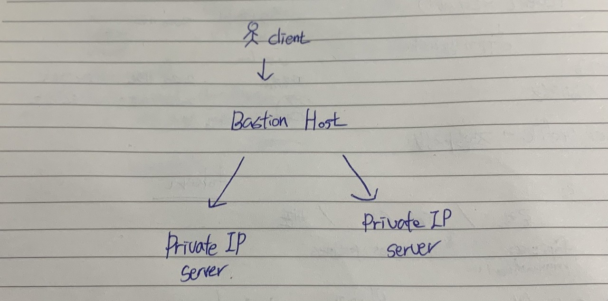

Bastion Host 란 보안을 위해 고안된 Host로 외부 네트워크와 내부 네트워크 사이에서 일종의 게이트웨이 역할을 수행하는 호스트를 뜻한다. 특히 Private IP로만 접근이 허용된 서버를 외부에서 접속하고자 할 경우, Bastion Host를 경유하여 Private IP 서버에 접근하도록 설계되곤 한다.

이렇게 관리할 경우, Bastion Host에서 특정 IP로의 접근만 허용하거나, 통신 로그를 일괄적으로 관리할 수 있는 편리함이 보장된다.

## Bastion Host Best Practice

기본적으로, Bastion Host와 Private 인스턴스는 SSH 접근 인증에 개인 키를 사용한다.

Bastion Host 에서 다른 인스턴스로 연결하는 경우에도 개인 키를 필요로 하는데, 여기에는 크게 2 가지 방법이 있다.

1.   Bastion Host에 사용자 Local PC의 개인키를 복사하는 것
2.   Bastion Host에서 SSH agent forwarding 을 사용하는 것

1번 방법은 Bastian Host에 문제가 생길 경우 모든 사용자의 개인 키가 손상될 가능성이 있기 때문에 추천하지 않는다. 추천하는 방법은 개인 키를 Bastion Host에 저장하는 것보다 SSH agent forwarding 사용하는 것이다. 뿐만 아니라 Bastion Host의 보안에 각별히 신경써야하기 때문에 불필요한 패키지들은 모조리 삭제한는 것이 좋다.

## Advantages & Disadvantages of Bastion Host

**장점**

-   단일 로그인 포인트를 설정하고 관리하기 때문에 방화벽 설계를 단순화 할 수 있다.
-   네트워크 사용에 관련한 로그를 한 곳에서 관리할 수 있다.
-   중소규모의 팀에서 매우 유용하게 사용할 수 있다.

**단점**

-   이 방법은 **오직 SSH 프로토콜만을 이용**하기 때문에 HTTP와 같은 어플리케이션 서비스에 사용할 수 없다.

[참고](https://www.learningjournal.guru/article/public-cloud-infrastructure/what-is-bastion-host-server/)